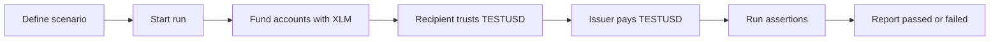

# Issued Asset Payment Lifecycle

This page explains how the bundled `issued-asset-payment` scenario moves from
definition to a completed run on Stellar Testnet.

## The scenario in one paragraph

The scenario starts with an issuer and a funded recipient. The recipient first
creates a trustline for `TESTUSD`, the issuer sends `100 TESTUSD`, and Esure
then asserts that the recipient balance equals `100 TESTUSD`.

## Lifecycle

## Run states

| State | Meaning |
|---|---|
| `requested` | The run was accepted and queued. |
| `running` | Esure is executing the scenario steps in order. |
| `passed` | Every step and assertion completed successfully. |
| `failed` | A step failed or an assertion did not hold. |

The API response for `POST /api/v1/runs` starts a run in the `requested` state.
Poll `GET /api/v1/runs/{runId}` to see progress and the final result.

## What happens in each step

### 1. Fund accounts

The scenario requests `100 XLM` for the issuer and `10 XLM` for the recipient.
Funding happens on Stellar Testnet before the issued asset steps run.

### 2. Create the trustline

The recipient executes a `changeTrust` operation for `TESTUSD`. Until this
step completes, the recipient cannot receive the issued asset.

### 3. Send the payment

The issuer executes a `payment` operation for `100 TESTUSD`. The payment is
denied if the trustline is missing or the issuer has no usable balance.

### 4. Verify the balance

Esure runs the `balanceEquals` assertion and checks that the recipient balance
for `TESTUSD` is `100`.

## What the report contains

The downloadable report records:

- Scenario ID and version
- Network (`testnet` in the MVP)
- Run state and completion time
- Per-step results
- Assertion results
- Summary counts

Reports are sanitized and contain no secret keys or raw Stellar envelopes.

## Related docs

- [Scenario format](./SCENARIOS.md)
- [Backend API contract](./API.md)
- [MVP specification](./MVP.md)
