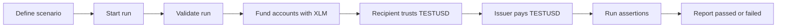

# Issued Asset Payment Lifecycle

This page explains how the bundled `issued-asset-payment` scenario moves from
definition to a completed run on Stellar Testnet, and how the related
`missing-trustline` scenario verifies the expected failure path.

## The scenario in one paragraph

The backend creates a temporary issuer and a temporary funded recipient. The
recipient first creates a trustline for `TESTUSD`, the issuer sends `100
TESTUSD`, and Esure then asserts that the recipient balance equals `100
TESTUSD`. The issuer is the account that defines the asset, so the payment
originates from the issuing account once the recipient trustline exists.

## Lifecycle



## Run states

| State | Meaning |
|---|---|
| `requested` | The run was accepted and queued. |
| `validating` | Esure is validating the run before execution. |
| `running` | Esure is executing the scenario steps in order. |
| `passed` | Every step and assertion completed successfully. |
| `failed` | A step failed or an assertion did not hold. |

The API response for `POST /api/v1/runs` starts a run in the `requested` state.
Poll `GET /api/v1/runs/{runId}` to see progress and the final result.

## What happens in each step

### 1. Fund accounts

The scenario funds the issuer and recipient with XLM on Stellar Testnet before
the issued asset steps run. The recipient needs XLM for the trustline's minimum
balance requirement and the issuer needs XLM for transaction fees.

### 2. Create the trustline

The recipient executes a `changeTrust` operation for `TESTUSD`. Until this step
completes, the recipient cannot receive the issued asset.

### 3. Send the payment

The issuer executes a `payment` operation for `100 TESTUSD`. The payment
requires an active recipient trustline for `TESTUSD`; the `missing-trustline`
scenario below covers what happens when that trustline is absent.

### 4. Verify the balance

Esure runs the `balanceEquals` assertion and checks that the recipient balance
for `TESTUSD` is `100`.

## Missing trustline

The bundled `missing-trustline` scenario is the expected-failure companion to
`issued-asset-payment`. It funds the same kinds of test accounts but omits the
recipient `changeTrust` step, so the issuer's payment is expected to fail.

Esure treats that failure as the correct outcome:

- The `send-testusd` step is recorded as `passed` with the message
  `Payment failed as expected because the recipient has no trustline.`
- The run adds a `stepFailedWith` assertion with the message
  `Missing trustline was rejected.`
- The run finishes as `passed` because the expected failure was observed.

This lets a negative behavior be tested as explicitly as a positive one.

## What the report contains

The downloadable report records:

- Run ID, scenario ID, and scenario version
- Network (`testnet` in the MVP)
- Run state and completion time
- Per-step results with transaction hashes and ledgers
- Assertion results
- Summary counts
- An `error` block only when the run failed

Reports are sanitized and contain no secret keys, no raw Stellar envelopes, and
no private key material. The example below uses synthetic identifiers and
transaction hashes.

```json
{
  "id": "00000000-0000-4000-8000-000000000001",
  "scenarioId": "issued-asset-payment",
  "scenarioVersion": 1,
  "network": "testnet",
  "status": "passed",
  "createdAt": "2026-08-08T00:00:00.000Z",
  "completedAt": "2026-08-08T00:00:06.000Z",
  "steps": [
    {
      "id": "fund-accounts",
      "type": "fundAccounts",
      "status": "passed",
      "message": "Test accounts funded."
    },
    {
      "id": "create-trustline",
      "type": "changeTrust",
      "status": "passed",
      "transactionHash": "0000000000000000000000000000000000000000000000000000000000000000",
      "ledger": 123456,
      "message": "Transaction confirmed on Stellar Testnet."
    },
    {
      "id": "send-testusd",
      "type": "payment",
      "status": "passed",
      "transactionHash": "0000000000000000000000000000000000000000000000000000000000000001",
      "ledger": 123457,
      "message": "Transaction confirmed on Stellar Testnet."
    }
  ],
  "assertions": [
    {
      "type": "balanceEquals",
      "status": "passed",
      "message": "Recipient holds 100 TESTUSD."
    }
  ],
  "summary": {
    "stepsPassed": 3,
    "stepsFailed": 0,
    "assertionsPassed": 1,
    "assertionsFailed": 0
  }
}
```

The report endpoint is `GET /api/v1/runs/{runId}/report`. It returns the final
sanitized report as a JSON attachment and answers `409` until the run reaches
`passed` or `failed`.

## Authoritative Stellar references

- [Issue an asset](https://developers.stellar.org/docs/tokens/how-to-issue-an-asset)
- [Verify trustlines](https://developers.stellar.org/docs/build/guides/basics/verify-trustlines)
- [Send and receive payments](https://developers.stellar.org/docs/build/guides/transactions/send-and-receive-payments)

## Related docs

- [Scenario format](./SCENARIOS.md)
- [Backend API contract](./API.md)
- [MVP specification](./MVP.md)
